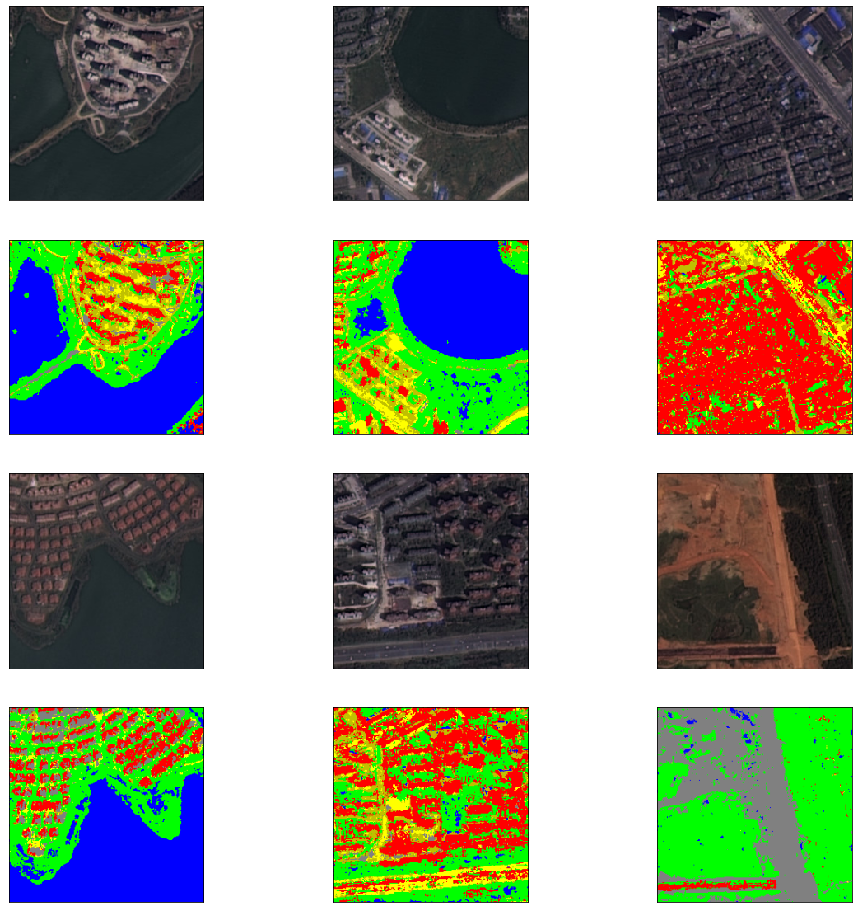

# Segmentation of Remotely Sensed Images with an Adaptive Neuro Fuzzy Inference System
[](https://colab.research.google.com/drive/1Pq1CU0vskGq2A5hyANWM7gGJZ_KHqxvM?usp=sharing)

The semantic segmentation of remotely sensed images is a difficult task because the images do not represent well-defined objects. To tackle this task, fuzzy logic represents a valid alternative to convolutional neural networks—especially in the presence of very limited data, as it allows to classify these objects with a degree of uncertainty. Unfortunately, the rules for doing this have to be defined by hand. To overcome this limitation, in this work we propose to use an adaptive neuro-fuzzy inference system (ANFIS), which automatically infers the fuzzy rules that classify the pixels of the remotely sensed images, thus realizing their semantic segmentation. The resulting fuzzy model guarantees a good level of accuracy
This model is also explanatory, since the classification rules produced are similar to the way of thinking of human beings.

This approach is used for segmenting remotely sensed images into six different classes: Building (Red), Road (Yellow), Pavement (Darker Yellow), Vegetation (Green), Bare Soil (Grey) and Water (Blue).



This work is part of the Computer Vision exam at University of Bari "Aldo Moro".

****
### Paper

Moreover, the work led to a [paper](https://www.researchgate.net/publication/358021524_Segmentation_of_remotely_sensed_images_with_a_neuro-fuzzy_inference_system) that was presented at the [13th International Workshop on Fuzzy Logic and Applications (WILF2021)](http://ceur-ws.org/Vol-3074/).

#### BibTeX Citation
```
@inproceedings{inproceedings,
author = {Castellano, Giovanna and Castiello, Ciro and Montemurro, Andrea and Vessio, Gennaro and Zaza, Gianluca},
year = {2021},
month = {12},
pages = {},
title = {Segmentation of remotely sensed images with a neuro-fuzzy inference system}
}
```
****
### Repository content

- Folder 'ANFIS-imgSatellitari' contains the ANFIS code (to train and test the model). There is also the folder 'model'
  which contains the ANFIS trained models (0 was used for the exam and the others are the model for the 6-class segmentation with 2, 3, 4 Fuzzy Sets per variable)
- Folder 'preprocessing' contains the original dataset, the pixel dataset and the scripts to generate it.
- The notebook "Anfis_training" is the notebook with used for the training of the 6-class segmentation model.

Note that the report shows the segmentation with 4 classes: a subsequent work extended the segmentation to six classes.

****
### Best Model
For the experiment the "reducedTopClass" were used, which was built by choosing the top 3 images with the greater number of pixel for each class (so for 6 classes there are 18 total images used to compose the pixel dataset).

The best model used for the experiment are those that have the words "topClass" in the models folder.

****
### References

[1] Diederich J. Andrews, R. and A. B. Tickle. Survey and critique of techniques for extracting rules form trained artificial neural networks. Knowledge-based Systems, 8:373–389,1995.

[2] J.R. Jensenr F. Qiu. Opening the black box of neural networks for remote sensing image classification. International Journal of Remote Sensing, 25(9):1749–1768, 2004.
[3] Demuth H. B. Hagan, M. T. and M. Beale. Neural network design. (Boston, MA: PWS, 1996.

[4] Stingchombe M. Hornik, K. and H. Whitee. Multilayer feed-forward networks are universal approximators. Neural Networks, 2(1):359–366, 1989.

[5] E. Shelhamer J. Long and T. Darrell. Fully convolutional networks for semantic segmentation, 2015. Proc. IEEE Conf. Comput. Vis. Pattern Recognit. (CVPR), pp. 3431-3440.

[6] Jyh-Shing R Jang. Anfis adaptive-network-based fuzzy inference system. IEEE Transactions on Systems Man and Cybernetics, 23(3):665–685, 1993.

[7] Fausett L. Fundamentals of neural networks: Architectures, algorithms, and applications. (Englewood Cliffs, NJ: Prentice Hall), 1994.

[8] George C. Stockman Linda G. Shapiro. Computer vision. New Jersey, Prentice-Hall, pages 279–375, 2001.

[9] G. W. Taylor M. D. Zeiler and R. Fergus. Adaptive deconvolutional networks for mid and high level feature learning. Proc. Int. Conf. Comput. Vis., pages 2018–2025, 2011.

[10] Klawoon F. Nauck, D. and R Kruse. Foundation of neuro-fuzzy system. (Chichester: John Wiley Sons), 1997.

[11] P. Fischer O. Ronneberger and T. Brox. U-net: Convolutional networks for biomedical image segmentation. Proc. Int. Conf. Med. Image Comput. Comput.-Assist. Intervent, pages 234–241, 2015.

[12] Yang K. Zhou W. Shao, Z. Evaluation of single-label and multi-label remote sensing image retrieval using a dense labeling dataset. Remote Sensing, 10(6):964, 2018.

[13] A. Kendall V. Badrinarayanan and R. Cipolla. Segnet: A deep convolutional encoder-decoder architecture for image segmentation. IEEE Trans. Pattern Anal. Mach. Intell., 39(12):2481–2495, 2017.

[14] Y. Bengio Y. Lecun, L. Bottou and P. Haffner. Gradient based learning applied to document recognition. Proc. IEEE, 86(1):2278–2324, 1998.
