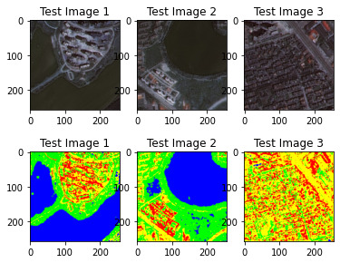

# Fuzzy Semantic Segmentation of Remotely Sensed Images 

Segmentation of remotely sensed images is a complicated task because the images do not depict well-defined objects.
To overcome this problem, fuzzy logic is really useful as it allows to classify these objects with a degree of uncertainty. 

In particular, an Adaptive Neuro Fuzzy Inference System (ANFIS), is useful for extracting fuzzy rules for pixel classification of images. 
We use this approach for segmenting remotely sensed images into four different classes: Building (Red), Road (Yellow), Vegetation (Green) and Water (Blue).

This work is part of the Computer Vision exam at University of Bari "Aldo Moro".

****
### Repository content

- Folder 'ANFIS-imgSatellitari' contains the ANFIS code (to train and test the model)
- Folder 'preprocessing' contains the original dataset, the pixel dataset and the scripts to generate it
- Folder 'notebook' contain the notebook that show the train of the model, and also the model that shows some results of the semantic classification. If you want to execute it in Google Colab, please copy the folder  'ANFIS-imgSatellitari' in the 'MyDrive' folder of your Google Drive. 
